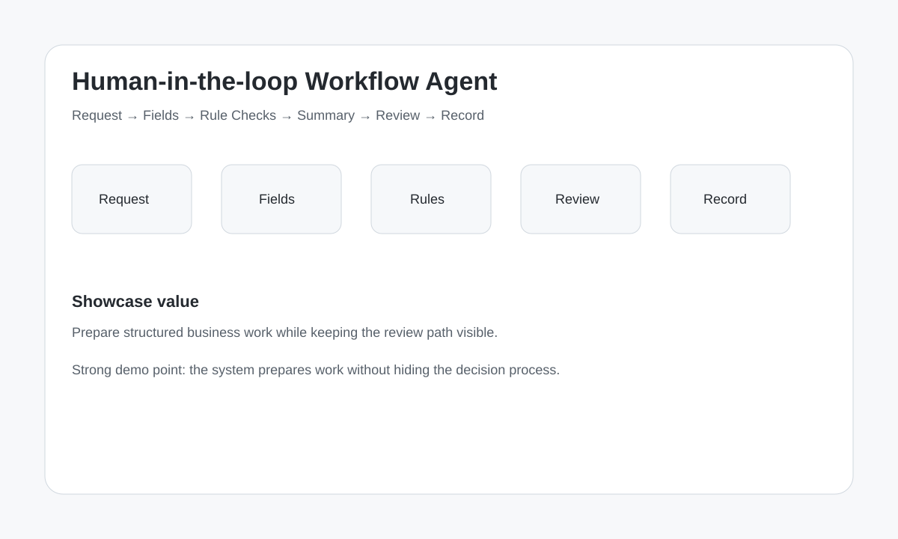

# Design Gallery

## Overview

## Demo intent

Use this visual as the first layout direction for the MVP demo.

The product should make reviewable workflow visible through:

- request intake
- extracted fields
- rule checks
- summary
- review screen
- final record
